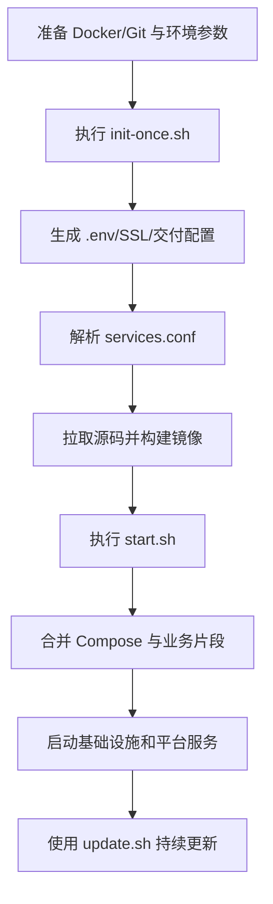



  

# g2rain-deploy

下一代AI软件开发范式，AI原生Agent平台，开源的企业级SaaS底座。

g2rain 平台标准化部署与环境编排仓库，负责基础设施、后端服务、前端应用与业务扩展的初始化、启动、停止和更新

[官网](https://www.g2rain.com) · [Issues](https://github.com/g2rain/g2rain/issues) · [Discussions](https://github.com/g2rain/g2rain/discussions)

## 目录

- 项目简介
- 平台定位
- 业务域说明
- 功能概览
- 使用场景
- 核心流程
- 流程图
- 技术栈
- 环境要求
- 快速开始
- 配置说明
- 构建与镜像
- 部署命令
- 安全说明
- 与关联仓库的关系
- 模块说明
- 职责边界
- 常见问题
- 关联仓库
- 参与贡献
- 许可证
- 联系我们
- 致谢

## 项目简介

g2rain 平台标准化部署与环境编排仓库，负责基础设施、后端服务、前端应用与业务扩展的初始化、启动、停止和更新

## 平台定位

该仓库用于组装或运行 g2rain 平台环境。

## 业务域说明

该仓库聚焦于 `平台部署编排、环境初始化、服务启停与持续更新`。

## 功能概览

| 能力 | 说明 |
| --- | --- |
| 首次环境初始化 | 通过 init-once.sh 初始化环境变量、交付配置、证书、源码目录和服务镜像。 |
| 平台启动与停止 | 通过 start.sh 与 stop.sh 统一执行 Compose 合并、依赖检查、平台启动和清理。 |
| 服务更新 | 通过 update.sh 支持全量或按服务拉取源码、重新构建镜像和重建容器。 |
| 业务扩展编排 | 通过 business.d 与 service_config.d 扩展业务 Compose 片段和服务构建映射。 |
| 交付配置治理 | 通过 config、env.example、services.conf 管理中间件、服务映射和环境配置。 |

## 使用场景

| 场景 | 说明 |
| --- | --- |
| 搭建演示或测试环境 | 当需要快速启动一套包含基础设施、后端服务和前端应用的完整 g2rain 环境时使用。 |
| 私有化部署 | 当企业需要在自有服务器或网络环境中部署 g2rain 平台时使用。 |
| 持续更新单个服务 | 当某个服务发布新版本，需要拉取源码、构建镜像并重建对应容器时使用。 |
| 扩展业务模块 | 当部署环境需要增加新的业务服务或 Compose 片段时使用。 |

## 核心流程

| 流程 | 关键步骤 | 代码线索 |
| --- | --- | --- |
| 首次安装 | 准备 env.example 与部署参数 → 执行 init-once.sh → 生成环境与证书配置 → 解析 services.conf → 拉取源码并执行各仓库 build.sh → 写入安装完成标记 | init-once.sh、services.conf、config |
| 平台启动 | 校验环境和 Compose CLI → 合并主编排与 business.d 片段 → 启动基础设施容器 → 等待核心依赖就绪 → 启动后端与前端服务 | start.sh、compose-cli-preference.inc、compose-merge.inc、docker-compose.yml |
| 服务更新 | 选择全量或指定服务 → 合并服务映射 → 拉取目标仓库 → 执行 build.sh 构建镜像 → 重建对应 Compose 服务 | update.sh、services-merge.inc、service_config.d |

## 流程图

## 技术栈

| 类别 | 说明 |
| --- | --- |
| 部署脚本 | Bash、Shell |
| 容器编排 | Docker、Docker Compose V1/V2 |
| 基础设施 | MySQL、Redis、Nacos、Kafka、Nginx/OpenResty |

## 环境要求

- Git
- Docker 20.10+
- docker-compose 或 docker compose
- JDK 与 Maven（源码镜像构建场景）

## 快速开始

| 步骤 | 命令或位置 | 说明 |
| --- | --- | --- |
| 准备环境 | Git、Docker、docker compose | 安装源码拉取与容器编排工具。 |
| 首次初始化 | `./init-once.sh --host <host> --port <port>` | 生成配置、拉取源码并构建服务镜像。 |
| 启动平台 | `./start.sh` | 启动基础设施与 g2rain 平台服务。 |
| 停止平台 | `./stop.sh` | 停止当前部署环境。 |

## 配置说明

### 环境配置

| 配置项 | 说明 |
| --- | --- |
| `env.example / .env` | 部署域名、端口、密码和服务运行参数。 |

### 服务映射

| 配置项 | 说明 |
| --- | --- |
| `services.conf` | 定义源码仓库、目录、Compose 服务和构建命令映射。 |

### 业务扩展

| 配置项 | 说明 |
| --- | --- |
| `business.d/*.yml` | 追加业务 Compose 片段而不修改主编排。 |

### 服务扩展

| 配置项 | 说明 |
| --- | --- |
| `service_config.d/*.conf` | 追加或覆盖服务构建映射。 |

## 构建与镜像

- 首次安装：./init-once.sh。
- 平台启动：./start.sh。
- 平台停止：./stop.sh。
- 服务更新：./update.sh [service]。

## 部署命令

| 目标 | 方式 | 命令 | 说明 |
| --- | --- | --- | --- |
| 首次初始化 | Shell | `./init-once.sh --host <部署域名或IP> --port <HTTPS端口>` | 初始化平台环境、配置和服务镜像。 |
| 启动平台 | Shell | `./start.sh` | 合并部署配置并启动平台服务。 |
| 停止并清理 | Shell | `./stop.sh --cleanup` | 停止平台并按脚本策略清理容器与网络。 |
| 更新指定服务 | Shell | `./update.sh g2rain-basis` | 更新并重建指定服务。 |

## 安全说明

| 主题 | 说明 |
| --- | --- |
| 敏感配置 | .env、数据库密码、应用密钥和证书不得提交到公开仓库，应通过部署环境安全注入。 |
| 脚本执行权限 | 部署脚本会拉取源码、构建镜像和操作容器，应仅由受信任的运维账号执行。 |
| 镜像与源码来源 | services.conf 中的源码仓库和镜像来源需要经过组织发布流程与版本校验。 |
| 数据持久化 | MySQL、Redis、Nacos 等持久化目录需要纳入备份、权限与灾难恢复策略。 |

## 与关联仓库的关系

本仓库位于平台交付与运维支撑侧，通过服务清单和 Docker Compose 编排 g2rain 基础服务、业务服务、主应用与前端子应用。

## 模块说明

| 模块 | 职责说明 | 代码线索 |
| --- | --- | --- |
| 核心生命周期脚本 | 负责首次初始化、启动、停止与更新。 | init-once.sh、start.sh、stop.sh、update.sh |
| Compose 编排 | 维护主编排、V2 编排和业务扩展片段合并。 | docker-compose.yml、compose-v2、business.d、compose-merge.inc |
| 服务构建映射 | 维护源码仓库、目录、Compose 服务名和构建命令映射。 | services.conf、service_config.d、services-merge.inc |
| 交付配置 | 维护中间件、数据库、Nginx、证书与应用运行配置。 | config、env.example |

## 职责边界

该仓库主要负责：
- 负责平台服务的部署配置、环境装配、启动停止与更新脚本
- 负责通过 Docker Compose 组织基础设施与 g2rain 服务运行关系

该仓库默认不负责：
- 不负责各业务服务的内部业务逻辑
- 不替代生产环境的密钥管理、备份恢复与高可用方案

## 常见问题

| 问题 | 可能原因 | 处理建议 |
| --- | --- | --- |
| Compose 命令不可用 | Docker Compose V1/V2 未安装或脚本偏好配置不匹配。 | 检查 docker-compose 或 docker compose，并确认 compose-cli-preference.inc 配置。 |
| 服务镜像构建失败 | 源码拉取失败、JDK/Maven/Node 环境缺失，或目标仓库 build.sh 执行失败。 | 检查 services.conf、Git 访问、构建工具和对应仓库构建日志。 |
| 平台服务未就绪 | MySQL、Redis、Nacos、Kafka 等依赖未启动或健康检查失败。 | 查看 Compose 状态和容器日志，先恢复基础设施服务。 |
| 更新未作用到目标服务 | 服务名、目录名或 Compose service 与 services.conf 映射不一致。 | 检查 services.conf、service_config.d 和实际 Compose 服务名称。 |

## 关联仓库

| 仓库 | 协作关系 |
| --- | --- |
| g2rain-basis | 协同提供用户、应用、通行证等平台基础主数据能力。 |
| g2rain-iam | 协同完成登录认证、令牌发放、SSO 回调或前端登录态衔接。 |
| g2rain-infra | 协同提供路由、配置、基础设施数据或平台运行支撑能力。 |
| g2rain-main-shell | 作为微前端主应用，负责装载子应用并提供统一平台入口。 |

## 参与贡献

我们欢迎所有形式的贡献：Issue 反馈、文档改进、功能建议与代码提交。

推荐流程：

1. Fork 本仓库。
2. 创建特性分支：`git checkout -b feature/your-feature-name`。
3. 提交更改：`git commit -m "Add some feature"`。
4. 推送分支：`git push origin feature/your-feature-name`。
5. 提交 Pull Request。

代码贡献前请尽量补充必要的测试和文档，并确保构建、测试与静态检查通过。

## 许可证

本项目基于 [Apache 2.0许可证](https://github.com/g2rain/g2rain-common/blob/main/LICENSE) 开源。

## 联系我们

- Issues: [GitHub Issues](https://github.com/g2rain/g2rain/issues)
- 讨论: [GitHub Discussions](https://github.com/g2rain/g2rain/discussions)
- 邮箱: g2rain_developer@163.com

## 致谢

感谢所有为 g2rain 项目提交 Issue、代码、文档、建议和使用反馈的开发者们！

