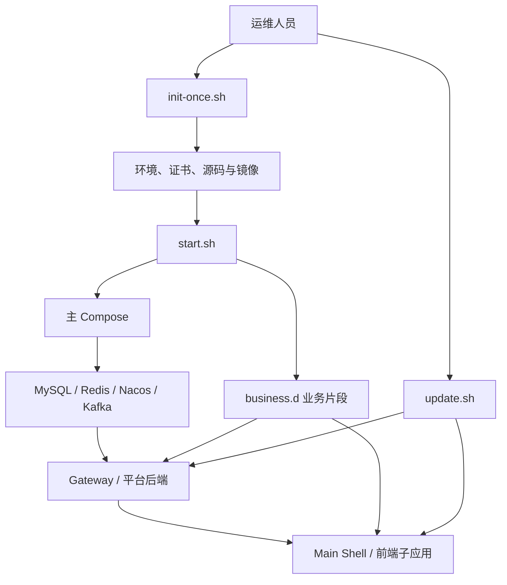

<p align="center">
  
</p>

# g2rain-deploy

[](LICENSE)
[](https://docs.docker.com/compose/)
[](https://www.gnu.org/software/bash/)

> 下一代AI软件开发范式，AI原生Agent平台，开源的企业级SaaS底座。

G2rain 平台标准化部署与环境编排仓库，负责基础设施、后端服务、前端应用和业务扩展的初始化、启动、停止、源码镜像构建与持续更新。

[工程文档](docs/index.md) · [官网](https://www.g2rain.com) · [Issues](https://github.com/g2rain/g2rain/issues) · [Discussions](https://github.com/g2rain/g2rain/discussions)

## 目录

- [项目简介](#项目简介)
- [功能概览](#功能概览)
- [部署拓扑](#部署拓扑)
- [环境要求](#环境要求)
- [快速开始](#快速开始)
- [配置与扩展](#配置与扩展)
- [部署命令](#部署命令)
- [验证](#验证)
- [安全说明](#安全说明)
- [模块说明](#模块说明)
- [职责边界](#职责边界)
- [常见问题](#常见问题)
- [关联仓库](#关联仓库)
- [参与贡献](#参与贡献)
- [许可证](#许可证)

## 项目简介

本仓库位于 G2rain 平台交付与运维层，以 Bash 和 Docker Compose 组装 MySQL、Redis、Nacos、Kafka、Nginx、平台后端、微前端主应用及子应用。它同时维护 Compose V1/V2 两套主编排，并允许通过独立片段扩展业务服务和源码构建映射。

本仓库不实现各服务的业务逻辑，也不替代生产级 Secret 管理、备份恢复、集群调度与高可用方案。

## 功能概览

| 能力 | 说明 |
| --- | --- |
| 首次初始化 | `init-once.sh` 准备 `.env`、可选证书、数据库初始化配置、源码目录和服务镜像。 |
| 生命周期管理 | `start.sh`、`stop.sh` 统一处理 Compose 选择、配置合并、依赖检查、健康等待与服务启停。 |
| 服务更新 | `update.sh` 支持全量或按 Compose 服务名同步源码、执行构建或拉取镜像并重建容器。 |
| 双 Compose 栈 | 支持 `docker-compose` + `docker-compose.yml`，以及 `docker compose` + `compose-v2/compose.yaml`。 |
| 业务扩展 | `business.d/*.yml` 在主 Compose 后合并，可增加 CMS 或其他业务模块。 |
| 服务映射扩展 | `service_config.d/*.conf` 可追加或按 Compose 服务名覆盖 `services.conf` 中的源码构建映射。 |
| 交付配置 | `config/` 管理 MySQL 初始化、Redis、Nacos、Nginx、SSL 和前端应用密钥材料。 |

## 部署拓扑

主编排包含 15 个服务：

- 基础设施：MySQL、Redis、Nacos、Kafka、Nginx
- 平台入口：`g2rain-gateway`
- 平台后端：`g2rain-infra`、`g2rain-basis`、`g2rain-iam`、`g2rain-department`、`g2rain-member`
- 前端：`g2rain-main-shell`、`g2rain-infra-app`、`g2rain-manager-app`、`g2rain-department-app`

默认业务片段 `business.d/g2rain-cms.yml` 增加 `g2rain-cms` 和 `g2rain-cms-app`，合并后共 17 个服务。



## 环境要求

- Linux 或兼容 Bash 的执行环境
- Git
- Docker Engine
- Docker Compose V1 或 V2
- JDK 与 Maven（初始化脚本会检查，源码镜像构建需要）
- OpenSSL（仅生成 SSL/应用密钥时需要）
- 足够的磁盘空间、内存、开放端口和持久化目录

## 快速开始

### 1. 准备环境配置

```shell
cp env.example .env
```

逐项修改 `.env` 中的平台地址、端口、数据库、Redis、Nacos 及其他认证配置。`env.example` 中的固定值仅供本地示例，禁止直接用于生产。

### 2. 检查 Compose 配置

```shell
docker compose --env-file .env -f docker-compose.yml config
```

使用 V2 主配置时：

```shell
docker compose --env-file .env \
  -f compose-v2/compose.yaml \
  --project-directory . \
  config
```

### 3. 首次初始化

```shell
./init-once.sh --host <平台域名或IP> --port <HTTPS端口>
```

初始化会克隆或更新多个 G2rain 仓库，并执行 `services.conf` 中声明的构建命令，但不会启动完整平台。仅准备配置或源码时可加 `--skip-build`。

### 4. 启动与检查

```shell
./start.sh
docker compose -f docker-compose.yml ps
```

启动脚本先启动 MySQL 与 Redis，再等待 MySQL、Redis、Nacos、Kafka 健康，最后启动完整服务栈。启动后还应检查容器日志、HTTPS 入口、登录和核心服务调用。

## 配置与扩展

| 文件或目录 | 作用 | 关键规则 |
| --- | --- | --- |
| `env.example` / `.env` | 平台地址、端口、中间件与运行参数 | `.env` 不应提交；生产环境必须替换所有示例凭据。 |
| `config/compose-cli.env` | 默认 Compose CLI 偏好 | 命令行 `--compose-v1`/`--compose-v2` 优先。 |
| `docker-compose.yml` | Compose V1 主编排 | 主文件始终最先加载。 |
| `compose-v2/compose.yaml` | Compose V2 主编排 | 使用 V2 时需保持与 V1 的服务语义一致。 |
| `business.d/*.yml` | 业务 Compose 扩展 | 默认加载全部；`--business <name>` 可重复并限定片段。 |
| `services.conf` | 默认源码构建映射 | 格式为 `repo|dir|compose_service|build_cmd`。 |
| `service_config.d/*.conf` | 服务映射扩展 | 相同 `compose_service` 后加载项整行覆盖；文件会被 Shell `source`。 |

业务片段和服务配置目录的默认扫描没有显式排序。存在覆盖关系时，应使用重复的 `--business` 或 `--service` 参数显式指定所需片段和顺序。

Compose CLI 偏好可通过以下命令探测并写入：

```shell
./scripts/write-compose-cli-preference.sh --dry-run
./scripts/write-compose-cli-preference.sh --write
```

## 部署命令

### 初始化

```shell
./init-once.sh [--host HOST] [--port PORT] [--skip-build] [--ssl-ip IP] [--force]
./init-once.sh --service <name> [--service <name> ...]
```

`--force` 会忽略安装完成标记重新执行；使用前先确认 `.env`、SQL 文件、源码目录和镜像的预期状态。

### 启动

```shell
./start.sh
./start.sh --compose-v2
./start.sh --business g2rain-cms
./start.sh --business <name> --service <name>
./start.sh kafka
```

### 停止

```shell
./stop.sh
./stop.sh --business <name>
```

需要扩大清理范围时才执行：

```shell
./stop.sh --cleanup
```

`--cleanup` 会清理容器、网络和未使用镜像。执行前必须确认当前 Docker Context、数据卷保留行为和恢复方案。

### 更新

```shell
./update.sh
./update.sh <compose-service>
./update.sh <compose-service> --force-pull
```

指定参数是 Compose 服务名，不一定等于仓库名。源码路径使用 `git fetch` 与 `git pull --ff-only`；`--force-pull` 使用镜像拉取路径。

以下命令会调用 Docker system prune，仅在明确接受影响时使用：

```shell
./update.sh --cleanup-all
```

完整参数见 [命令参考](docs/operations/commands.md)。

## 验证

| 检查 | 命令 | 当前结果 |
| --- | --- | --- |
| Shell 语法 | `bash -n <script>` | 2026-09-06 检查 10 个 Shell/Include 文件，全部通过。 |
| Compose V1 | `docker compose --env-file env.example -f docker-compose.yml config` | 主配置及默认 CMS 合并配置解析通过；`version` 属性产生已过时警告。 |
| Compose V2 | `docker compose --env-file env.example -f compose-v2/compose.yaml --project-directory . config` | 主配置及默认 CMS 合并配置解析通过。 |
| 运行时部署 | `./start.sh` 后执行健康与业务冒烟检查 | 本轮未执行，不能据静态验证声称整套平台运行成功。 |

验证策略详见 [工程验证文档](docs/development/testing.md)。

## 安全说明

| 主题 | 要求 |
| --- | --- |
| 示例凭据 | `env.example` 中存在固定示例密码和认证材料，生产环境必须全部替换并通过受控 Secret 注入。 |
| 应用私钥 | 仓库当前跟踪多个前端应用目录下命名为私钥的 PEM/DER 文件；只能视为不可信演示材料，禁止生产复用。若曾被使用，必须轮换。 |
| 扩展脚本 | `service_config.d/*.conf` 会被 `source`，其中的 `build_cmd` 以及被拉取仓库的 `build.sh` 都属于代码执行边界，只能使用受评审来源。 |
| 数据与网络 | MySQL、Redis、Nacos、Kafka 不应暴露到不可信网络；需要最小权限、备份、TLS/网络隔离和恢复演练。 |
| 镜像与源码 | 避免只依赖不可追溯的 `latest`；生产发布应记录镜像 digest、源码提交和配置版本。 |
| 清理命令 | `--cleanup`、`--cleanup-all` 会扩大 Docker 清理范围，执行前确认 Context、数据影响和回滚方案。 |

生产安全要求见 [安全、密钥与数据](docs/security/secrets-and-data.md)。本仓库中的演示密钥是否从当前版本及 Git 历史删除，需要单独的安全治理决策。

## 模块说明

| 模块 | 职责 |
| --- | --- |
| `init-once.sh` | 创建环境、可选生成证书、同步源码、执行镜像构建并管理安装标记。 |
| `start.sh` | 选择 Compose 栈、检查配置与镜像、等待基础设施健康并启动服务。 |
| `stop.sh` | 停止当前合并栈；显式参数可执行额外清理。 |
| `update.sh` | 全量或按服务更新源码/镜像、重建容器并可选清理镜像。 |
| `compose-*.inc` | 解析 CLI 偏好，组织主 Compose 与业务片段的参数链。 |
| `services.conf` / `services-merge.inc` | 定义并合并仓库、源码目录、Compose 服务与构建命令。 |
| `business.d` | 提供可选业务服务编排，默认包含 CMS 后端与前端应用。 |
| `service_config.d` | 按环境或业务模块追加、覆盖源码构建映射。 |
| `config` | 提供中间件、数据库初始化、Nginx、SSL 与应用密钥配置。 |

## 职责边界

本仓库负责：

- 维护平台部署拓扑、环境装配和服务生命周期脚本
- 维护源码构建映射、Compose V1/V2 兼容及业务片段扩展机制
- 提供本地、演示或私有化环境的标准部署入口

本仓库不负责：

- 各后端服务或前端应用的内部业务实现
- 生产 Secret 托管、证书权威、数据库迁移平台和灾难恢复系统
- Kubernetes 等集群调度、高可用架构和多节点自动容灾
- 在未经验证的环境中保证脚本执行结果或数据可恢复性

## 常见问题

| 问题 | 可能原因 | 处理建议 |
| --- | --- | --- |
| Compose 命令不可用 | V1/V2 未安装或 CLI 偏好与本机不一致 | 运行偏好探测脚本，或显式使用 `--compose-v1`/`--compose-v2`。 |
| Compose 合并结果异常 | 业务片段重复定义服务，或依赖默认扫描顺序 | 使用 `docker compose ... config` 检查最终结果，并显式指定片段顺序。 |
| 服务镜像构建失败 | Git 访问、JDK/Maven、源码目录或目标仓库 `build.sh` 异常 | 检查 `services.conf`、扩展映射、仓库日志和构建工具。 |
| 平台服务未就绪 | MySQL、Redis、Nacos、Kafka 未健康，或端口/卷/权限异常 | 查看 Compose 状态与容器日志，先恢复基础设施。 |
| 指定服务未更新 | 参数使用了仓库名而非 Compose 服务名，或映射被片段覆盖 | 检查最终服务映射和 Compose 服务名称。 |
| MySQL 初始化 SQL 未生效 | 数据卷已存在 | 初始化 SQL 只在空数据卷首次创建时执行；已有数据使用受控迁移流程。 |
| 源码无法快进更新 | checkout 存在本地提交、分叉或冲突 | 先确认本地变更归属，再人工处理分支；脚本使用 `pull --ff-only`。 |

## 关联仓库

`services.conf` 和默认 Compose 当前编排 Gateway、Infra、Basis、IAM、Department、Main Shell 及多个前端应用；`business.d/g2rain-cms.yml` 追加 CMS 后端和 CMS App。本仓库只负责组装和生命周期管理，各项目仍独立负责自身构建与运行行为。

## 参与贡献

欢迎通过 Issue、文档改进、功能建议和代码提交参与贡献。部署变更应保持单一目的，同时验证两套 Compose、相关业务片段和 Shell 语法；涉及数据、密钥或清理行为时，请在 Pull Request 中说明影响与回滚方案。

## 许可证

本项目基于 [Apache License 2.0](LICENSE) 开源。

## 联系我们

- Issues: [GitHub Issues](https://github.com/g2rain/g2rain/issues)
- 讨论: [GitHub Discussions](https://github.com/g2rain/g2rain/discussions)
- 邮箱: g2rain_developer@163.com

## 致谢

感谢所有为 G2rain 项目提交 Issue、代码、文档、建议和使用反馈的开发者们！
